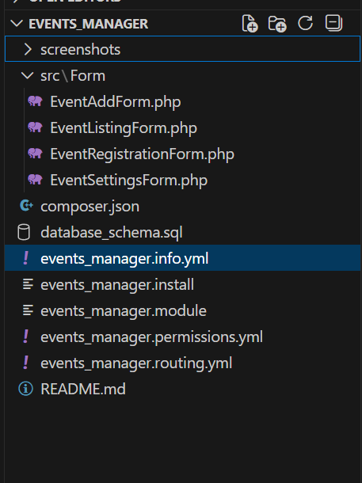
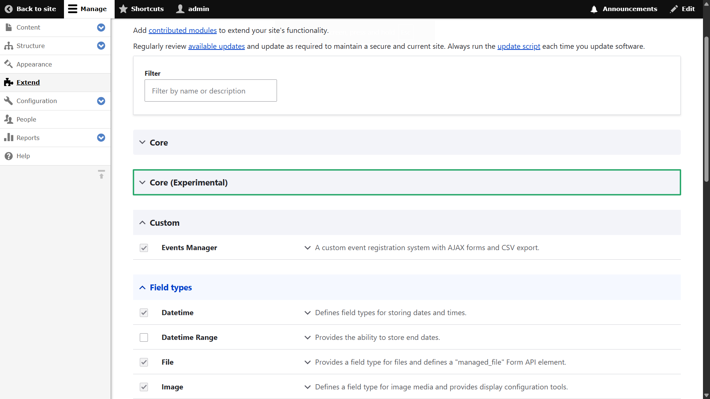
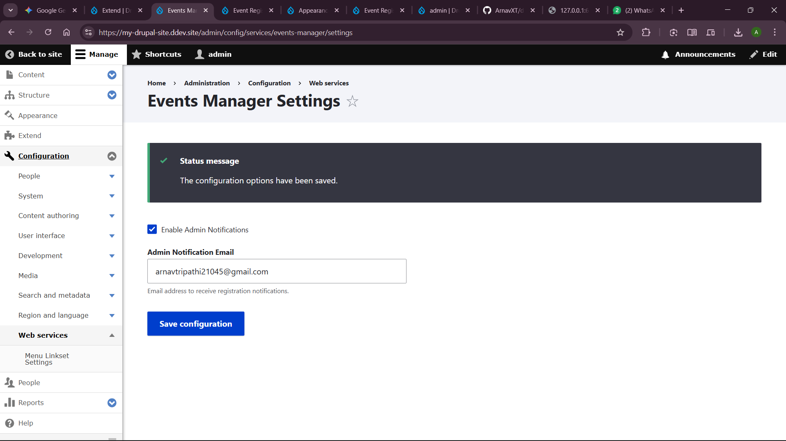
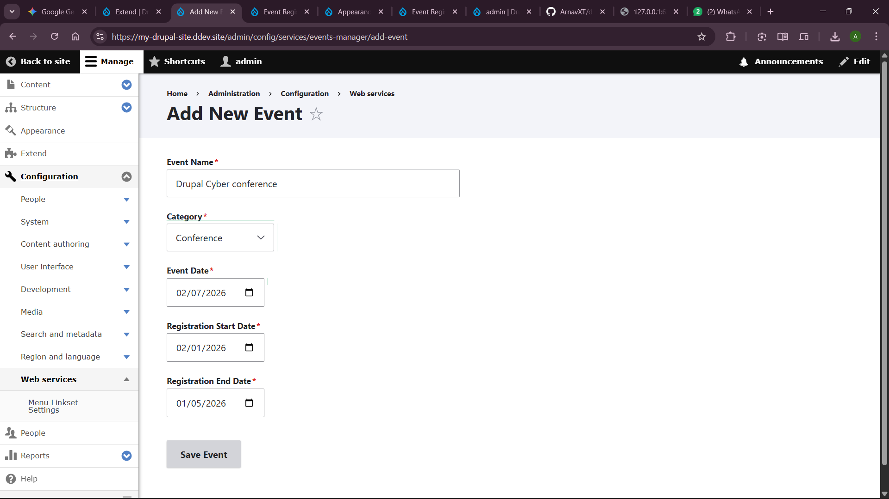
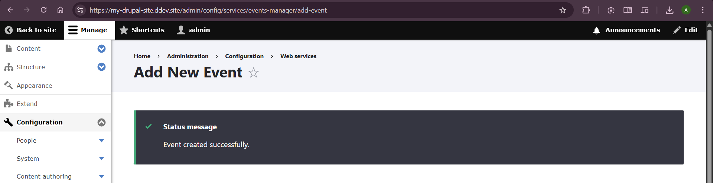
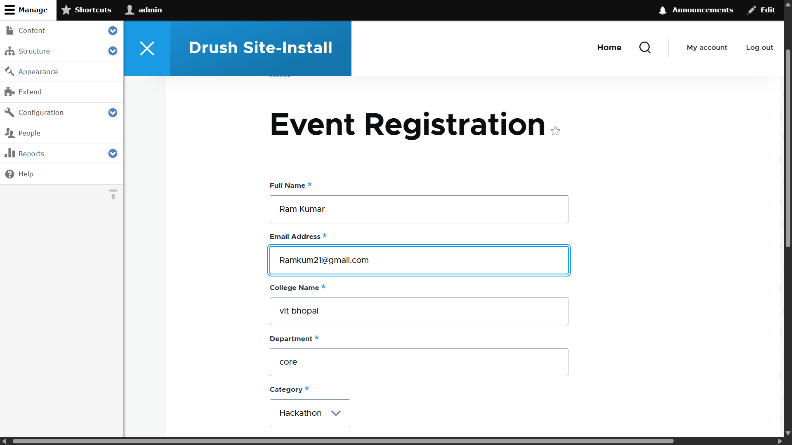
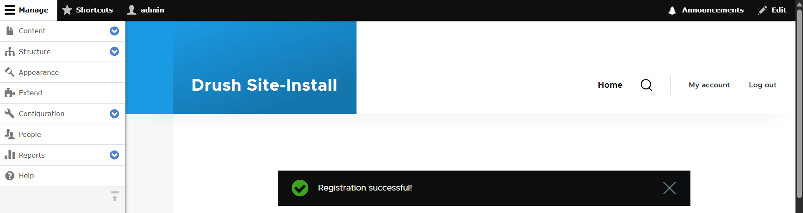
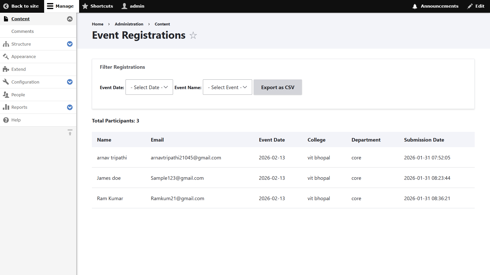
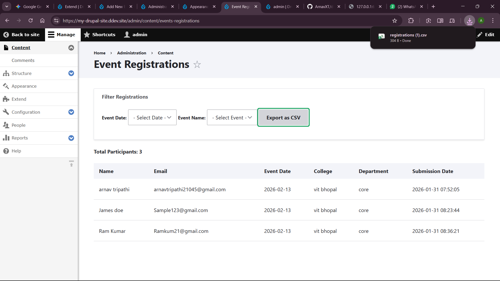

# Events Manager Module

A custom Drupal 10 module for managing event registrations. This module allows admins to create events and users to register for them via a custom form. It includes AJAX-dependent fields, CSV export capabilities, and email notifications.

---

## 📌 Features

### 1. Data Storage (Custom Database)
The module stores data in two custom database tables:
* **`events_manager_event`**: Stores event configuration (ID, Name, Category, Dates).
* **`events_manager_registration`**: Stores user registrations with a foreign key linking to the event.

### 2. Email Notifications (Drupal Mail API)
Sends automated confirmation emails using the Drupal Mail API:
* **To User**: Confirms their registration with details (Name, Event Name, Date, Category).
* **To Admin**: Notifies the administrator of a new signup (configurable).

### 3. Configuration Page (Config API)
An admin interface to:
* Enable/Disable admin notifications.
* Set the Admin Notification Email address.
* *Note: Uses Drupal Config API (no hard-coded values).*

### 4. Admin Listing Page
A dedicated dashboard for administrators to:
* **Filter** registrations by Date and Event Name (using AJAX).
* **View** participant counts.
* **Export** the filtered list to CSV.
* **Secure** access restricted by custom permissions.

---

## 🚀 Installation & Setup

### Step 1: Create the Folder Structure
Navigate to your Drupal project's `web/modules` directory and create the folder structure as shown below:
`web/modules/custom/events_manager`



### Step 2: Add Module Files
Place all the module files (`.info.yml`, `.module`, `src/`, etc.) into this directory.

### Step 3: Enable the Module
You can enable the module using Drush or the Drupal Admin Interface.

**Option A: Using Drush (Recommended)**
Open your terminal in the project root and run:
```bash
ddev drush en events_manager -y
```
---

## Screenshots of Execution

### 1. Enable Module


### 2. Configuration: Configure Global Settings


### 3. Usage: Add Event Page



### 4. Usage: Event Registration Page



### 5. Admin Management: View Event Registrations


### 6. Admin Management: Export Data


## 🗄️ Database Schema

### `event_registration_event`
Stores events created by administrators.

**Fields:**
- `event_name`
- `category`
- `event_date`
- `reg_start_date`
- `reg_end_date`
- `created` (timestamp)

---

### `event_registration_entry`
Stores user registrations for events.

**Fields:**
- `event_id` (Foreign Key referencing `event_registration_event`)
- `full_name`
- `email`
- `college`
- `department`
- `created` (timestamp)

**Constraints:**
- Unique index on **(`email`, `event_id`)** to prevent duplicate registrations.

---

## ✅ Validation Rules

The registration form enforces the following validations:
- All required fields must be filled.
- Text fields do not allow special characters.
- Email addresses are validated for correct format.
- Duplicate registrations for the same event are prevented.
- Registrations are allowed only within the configured registration period.

---

## ⚡ AJAX Functionality

**User Registration Form:**
- Dynamic filtering in the order:  
  **Category → Event Date → Event Name**

**Admin Dashboard:**
- Filter registrations by **Event Date → Event Name**
- Registration list updates dynamically using AJAX.

---

## ✉️ Email Notifications

Email notifications are implemented using the **Drupal Mail API** (`hook_mail`).

**Emails sent:**
- Registration confirmation email to the user.
- Optional notification email to the administrator.

**Configuration:**
- Admin notification email is configurable via the **Drupal Config API**.

---

## 🔐 Permissions

- Custom permission: **View event registrations**
- Restricts access to the admin dashboard and registration listings.

---

## 🛠️ Technical Standards

- Compatible with **Drupal 10.x**
- Built using **Form API**, **Config API**, and **Schema API**
- Follows **PSR-4 autoloading standards**
- No contributed modules used
- Adheres to **Drupal coding standard**
